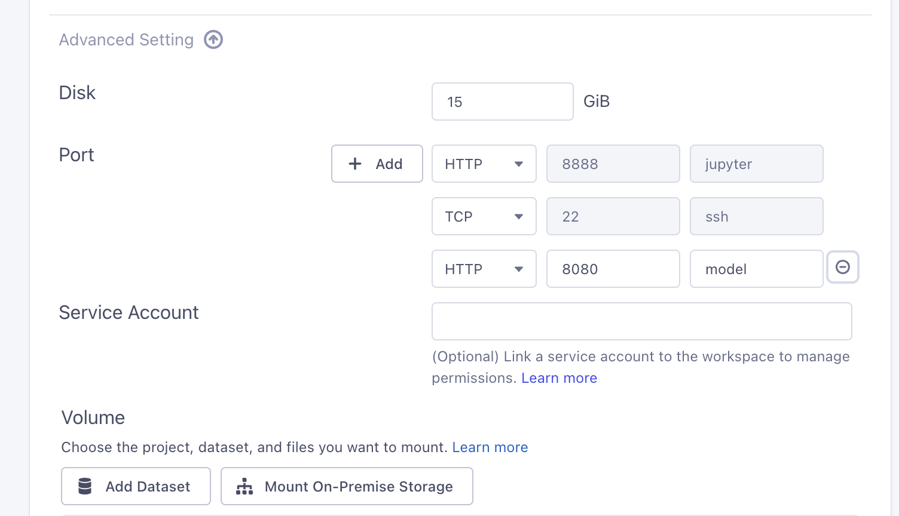

# Memegorithm

<p align="center">
  
</p>

<!--  -->
## Last Update (December 25, 2023)
> Included example images

> Included [README.md](./visual_sentiment_prediction/README.md) for running visual sentiment prediction (VSP)

## Getting Started
### Prerequisites

- Python >= 3.8
- pip
- Flask
- Flutter
- Firebase database & auth token: `./llm_inference/*.json`

### How to run (Quickstart)

#### Flask server (Model serving)

1. Clone the repository:

```sh
git clone https://github.com/youngosil/Memegorithm.git
```

2. Run required dependencies
```sh
cd llm_inference
pip install -r requirements.txt
```

3. Run flask server
```sh
python app.py --port 5000
```

#### Flutter

```sh
cd ./memegorithm_web

flutter run -d chrome --web-renderer html

or

./run.sh
```

### Vessl에서 model serving을 해보고 싶다면
1. 학교 밖이라면 ysvpn 켜기
2. 새 workspace run
- Port 명시 (8080 외의 다른 port로 해도 되지만, 코드 수정 필요)

- Run이 되면 8080 model 옆의 링크를 눌러서 접근 가능한 url 복사 (http://165.132.46.91:31515/ 등)

3. `memegorithm_web/lib/pages/post/write_post_screen.dart`에서 String url을 위에서 복사한 주소로 변경
4. `llm_inference/app.py`에서 host를 0.0.0.0으로 변경, 포트는 변경 불필요 (8080 외 포트 지정하였다면 `python app.py`에서 argument로 전달하면 됨)
5. 필요한 dependency 설치하고 python app.py로 실행
- 백그라운드에서 계속 실행해두려면 아래 명령어 활용 (터미널 닫아도 계속 실행)
```sh
nohup python app.py > run.log 2>&1 &
```